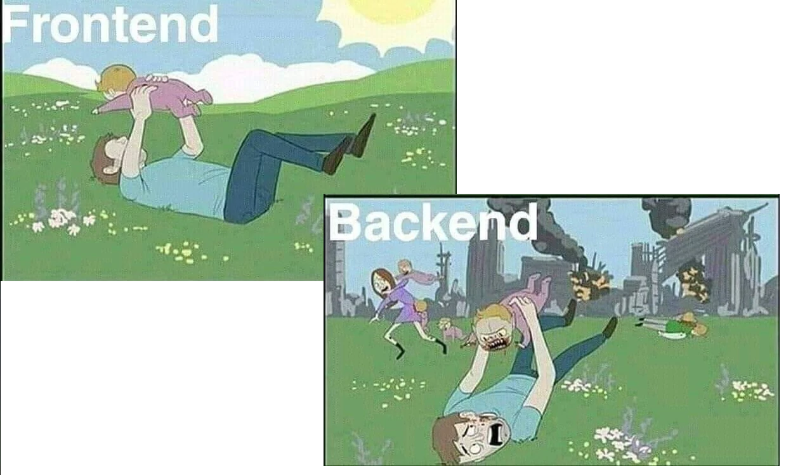
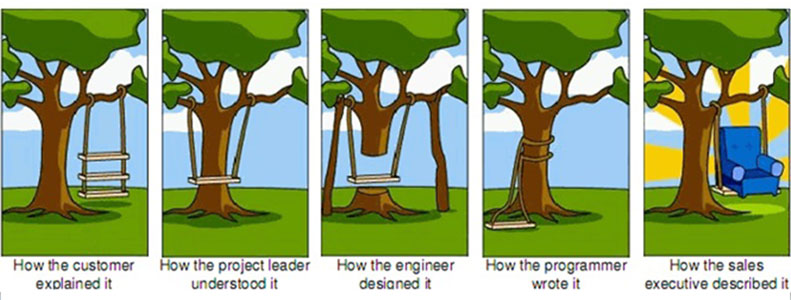

============================================
Anti-patterns turtle of software engineering
============================================

by Maksym Shalenyi (enkidulan)

.. note::
    This talk's goal is to introduce anti-patterns concept that is
    focused on helping in identifying defective processes and implementations,
    and on providing a common vocabulary, as well as on saving businesses, lives,
    planet and developers' sanity.

Bipolar misconception
=====================

.. note::
    One of misconception is that there is only good or bad...
    Perfectionism

The turtle
==========

.. note::
    * use-cases
    * technical debt
    * legacy

    Software usually is a pretty much gray area, no project can escape
    from bad technical/management/business decisions that are needed to
    be supported for some time. It is crucially important to identify defective
    practices right away, so keeping a healthy balance between trade-offs
    and delivery speed won't become impossible, especially in the context of
    long-term goals and changing requirements.

Dress code defective
====================

.. note:

    * commonly occurring solution to a problem that generates decidedly negative consequences
    * not having sufficient knowledge or experience in solving a particular type of problem,
    * or having applied a perfectly good pattern in the wrong context

All is (Not) going well
=======================

    * more bad then good
    * ignorance is bliss

.. note:

    * A commonly used process, structure, or pattern of action that despite initially appearing to be an appropriate and effective response to a problem, has more bad consequences than good ones.
    * Another solution exists that is documented, repeatable, and proven to be effective.

Types
=====

    * Organizational
    * Management
    * Design
    * Programming
    * Methodological
    * Configuration

Organizational
===============

Analysis paralysis | Bicycle shed | Bleeding edge | Seagull management

**Bicycle shed:**

.. code-block:: text

    Giving disproportionate weight to trivial issues

Management
===============

Death march | Overengineering | Scope creep | Brooks's law

**Brooks's law:**

.. code-block:: text

    Adding more resources to a project to increase velocity,
    when the project is already slowed down by coordination overhead.

Design
===============

Big ball of mud | Gold plating | Input kludge | Abstraction inversion

**Gold plating:**

.. code-block:: text

    Continuing to work on a task or project well past the point
    at which extra effort is not adding value

Programming
===============

Error hiding | God object | Sequential coupling | Yo-yo problem

**Yo-yo problem:**

.. code-block:: text

     A structure (e.g., of inheritance) that is hard to
     understand due to excessive fragmentation

Methodological
===============

Premature optimization | Reinventing the square wheel | Silver bullet | Tester Driven Development

**Silver bullet:**

.. code-block:: text

     Assuming that a favorite technical solution can solve a larger process or problem

Configuration
===============

Fragmented configuration | Dependency hell | Docker-driven-versioning | Debug everywhere

**Dependency hell:**

.. code-block:: text

     Problems with versions of required products

Thank you!
==========

Links
=====

* https://sourcemaking.com/antipatterns
* https://en.wikipedia.org/wiki/Anti-pattern
* https://www.youtube.com/watch?v=X0tjziAQfNQ

